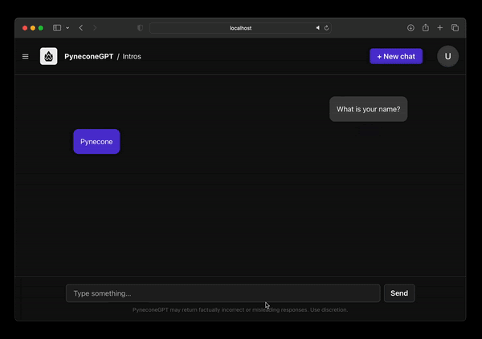

# Reflex Chat App

**This is a fork of the original [Reflex Chat](https://github.com/reflex-dev/reflex-chat) with enhanced multi-provider support.**

A user-friendly, highly customizable Python web app designed to demonstrate LLMs in a ChatGPT format with support for multiple LLM providers. This fork serves as an excellent example for developers who want to learn how to implement and integrate different LLM providers in their applications.

## What's New in This Fork

- **Added Ollama support** - Run local models with real-time streaming
- **Added Google Gemini support** - Including Vertex AI integration with streaming
- **Enhanced provider architecture** - Clean, extensible factory pattern for adding new providers
- **Unified streaming** - All providers now support real-time response streaming
- **uv support** - Lightning-fast dependency management

## Learning Resource

This fork is designed to help developers understand:

- How to implement multiple LLM provider integrations
- Async streaming patterns for real-time chat
- Clean architecture patterns for provider management
- Environment-based configuration for different services
- Error handling and fallback mechanisms

<div align="center">

</div>

# Getting Started

## Choose Your LLM Provider

The app supports three LLM providers. Configure the one you want to use:

### Option 1: OpenAI

You'll need a valid OpenAI subscription. Copy `.env.example` to `.env` and configure:

```bash
cp .env.example .env
```

Then edit `.env` with your OpenAI credentials:

```env
LLM_PROVIDER=openai
OPENAI_API_KEY=your_openai_api_key_here
OPENAI_MODEL=gpt-4o  # or gpt-4o-mini, gpt-5-mini, etc.
```

### Option 2: Ollama (Local Models)

Run models locally using Ollama:

1. [Install Ollama](https://ollama.ai/download)
2. Start Ollama server: `ollama serve`
3. Pull a model: `ollama pull gemma3:4b`
4. Configure your `.env`:

```env
LLM_PROVIDER=ollama
OLLAMA_HOST=http://localhost:11434  # optional, defaults to this
OLLAMA_MODEL=gemma3:4b  # required: must be a model you have installed
```

### Option 3: Google Gemini

Use Google's Gemini models. Configure your `.env`:

```env
LLM_PROVIDER=gemini
GEMINI_API_KEY=your_gemini_api_key_here
GEMINI_MODEL=gemini-2.0-flash  # or gemini-1.5-flash, gemini-2.0-pro, etc.
```

For Vertex AI (Enterprise Google Cloud):

```env
LLM_PROVIDER=gemini
GEMINI_API_KEY=your_gemini_api_key_here
GOOGLE_USE_VERTEXAI=true
GOOGLE_PROJECT_ID=your-gcp-project-id
GOOGLE_LOCATION=us-central1  # optional
GEMINI_MODEL=gemini-2.0-flash
```

### 🧬 1. Clone the Repo

```bash
git clone https://github.com/reflex-dev/reflex-chat.git
cd reflex-chat
```

### 📦 2. Install Dependencies

To get started with Reflex, you'll need Python 3.10+. You can install dependencies using either **pip** (traditional) or **uv** (recommended for faster installs).

#### Using uv 

2. **Install and sync dependencies**:
   ```bash
   uv sync
   ```

#### Using pip

Install all dependencies with the provided `requirements.txt`:

```bash
pip install -r requirements.txt
```

### 🚀 3. Run the application

Initialize and run the app:

```bash
reflex init
reflex run
```

#### Model Specification:

- **OpenAI**: `OPENAI_MODEL` (your chosen model, e.g., gpt-5-mini, gpt-4o, etc.)
- **Ollama**: `OLLAMA_MODEL` (your local model, e.g., gemma3:4b, llama3.2, etc.)
  - Note: Ollama requests use `num_ctx=4096` by default for optimal context window
- **Google**: `GEMINI_MODEL` (your chosen model, e.g., gemini-2.0-flash, gemini-2.5-pro, etc.)

## Environment Variables Reference

| Variable              | Required      | Default                  | Description                          |
| --------------------- | ------------- | ------------------------ | ------------------------------------ |
| `LLM_PROVIDER`        | No            | `openai`                 | Choose: `openai`, `ollama`, `gemini` |
| `OPENAI_API_KEY`      | For OpenAI    | -                        | Your OpenAI API key                  |
| `OPENAI_MODEL`        | For OpenAI    | -                        | OpenAI model to use                  |
| `OLLAMA_HOST`         | No            | `http://localhost:11434` | Ollama server URL                    |
| `OLLAMA_MODEL`        | For Ollama    | -                        | Ollama model to use                  |
| `GEMINI_API_KEY`      | For Gemini    | -                        | Your Google API key                  |
| `GEMINI_MODEL`        | For Gemini    | -                        | Gemini Model to use                  |
| `GOOGLE_USE_VERTEXAI` | No            | `false`                  | Use Vertex AI instead                |
| `GOOGLE_PROJECT_ID`   | For Vertex AI | -                        | GCP project ID                       |
| `GOOGLE_LOCATION`     | No            | `us-central1`            | GCP region                           |

# Features

- **100% Python-based**, including the UI, using Reflex
- **Create and delete chat sessions**
- **Real-time streaming** responses for all LLM providers (OpenAI, Ollama, Gemini)
- **Multiple LLM support**: OpenAI, Ollama (local), Google Gemini with Vertex AI
- **Fully customizable** - no web dev knowledge required
  - See https://reflex.dev/docs/styling/overview for more details

# License

The following repo is licensed under the MIT License.
